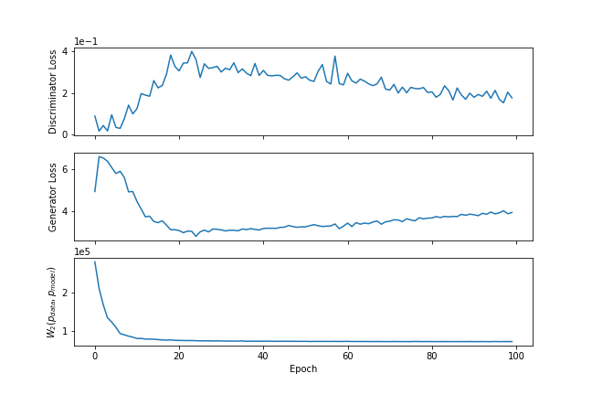
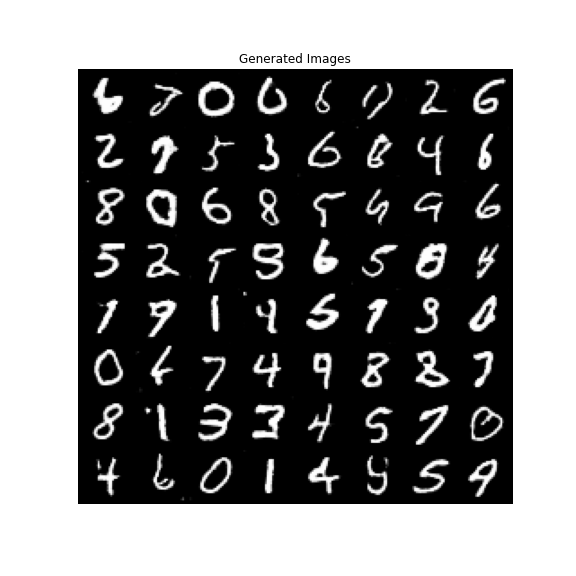

# Generative Modeling

## DCGAN

The implementation here presented is simillar to that of [AKASHKADEL](https://github.com/AKASHKADEL/dcgan-mnist).

### Results

 <table>
    <tr>
        <th>Generated Samples</th>
        <td></td>
    </tr>
    <tr>
        <td>Learning Curves</td>
        <td></td>
    </tr>
</table> 